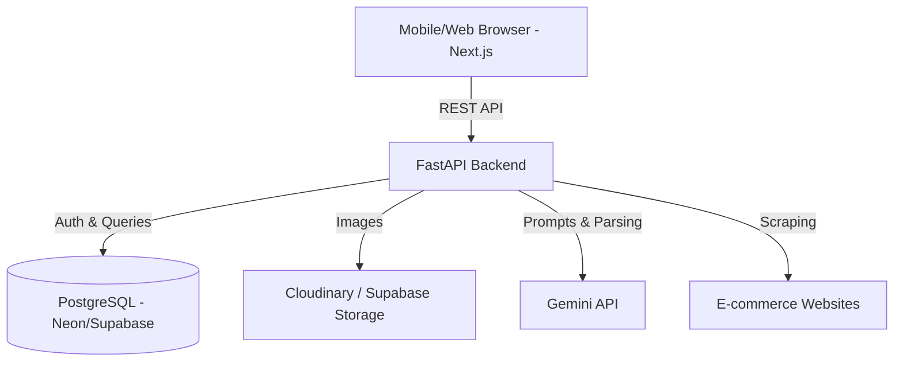
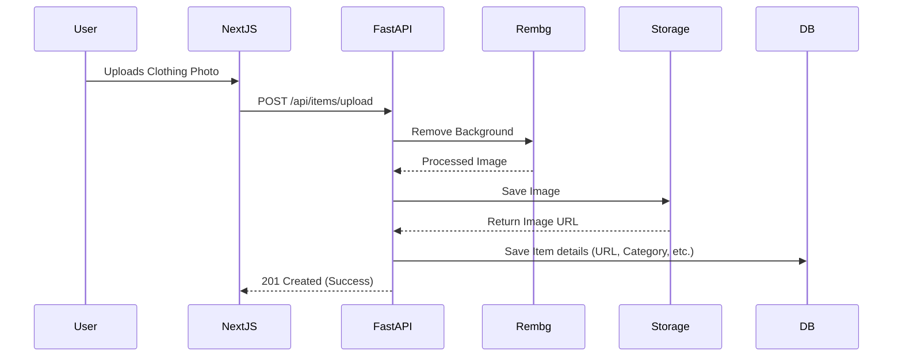
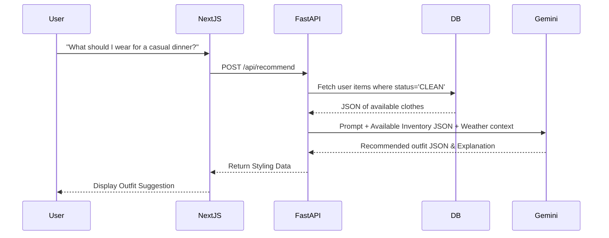
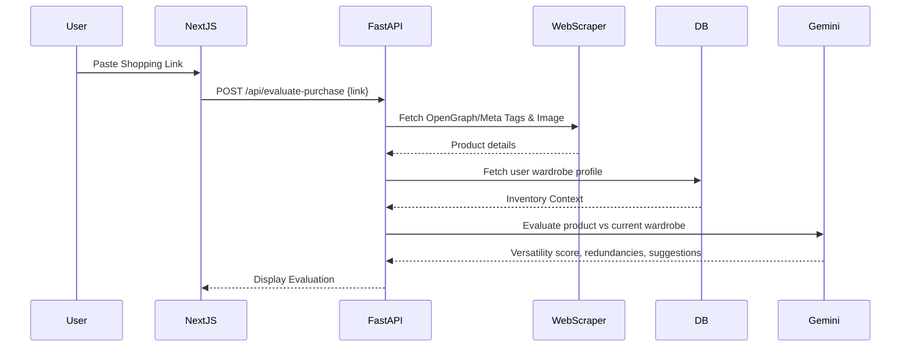

# Smart AI Wardrobe & Styling Assistant
**Author:** Adhishthan Ashok
**Project Type:** Full-Stack Web Application (Mobile-Responsive)
**Scale:** Personal / Micro-Scale (1-5 users)

---

## 1. Project Goal
To build a highly responsive, web-based digital wardrobe and AI styling assistant. The application allows users to digitize their clothing inventory, track item states (clean/worn), receive context-aware outfit recommendations using LLMs, and evaluate potential new clothing purchases against their existing inventory to prevent redundant shopping. It acts as an interactive, intelligent extension of a physical closet.

## 2. Infrastructure & Free-Tier Tech Stack
Designed to operate at $0/month using generous free tiers, optimized for low concurrency.

*   **Frontend:** Next.js (React) + TailwindCSS. Accessible via any mobile/tablet browser. Deployed on **Vercel** (Free Tier).
*   **Backend:** **FastAPI** (Python). Chosen for high performance, ease of use with data validation (Pydantic), and native async support. Deployed on **Render** or **Railway** (Free Tier).
*   **Database:** PostgreSQL. Hosted on **Supabase** or **Neon** (Free Tier).
*   **Image Storage:** **Cloudinary** or **Supabase Storage** (Free Tier) to store uploaded clothing images.
*   **AI / LLM Engine:** **Google Gemini API** (using existing Gemini Pro subscription/free tier) for parsing shopping links, analyzing outfit compatibility, and generating recommendations.
*   **Image Processing:** `rembg` (Python library) running on the FastAPI backend for free, offline background removal before uploading to storage.

---

## 3. System Architecture Diagrams

### A. High-Level System Architecture


### B. Image Upload & Digitization Flow


### C. Outfit Recommendation Flow


### D. Shopping Link Evaluation Flow


---

## 4. Database Schema (PostgreSQL)

```sql
-- Core Users Table
CREATE TABLE users (
    id UUID PRIMARY KEY DEFAULT gen_random_uuid(),
    username VARCHAR(50) UNIQUE NOT NULL,
    password_hash VARCHAR(255) NOT NULL,
    last_login TIMESTAMP WITH TIME ZONE DEFAULT CURRENT_TIMESTAMP,
    created_at TIMESTAMP WITH TIME ZONE DEFAULT CURRENT_TIMESTAMP
);

-- Clothing Inventory Table
CREATE TABLE items (
    id UUID PRIMARY KEY DEFAULT gen_random_uuid(),
    user_id UUID REFERENCES users(id) ON DELETE CASCADE,
    image_url TEXT NOT NULL,
    category VARCHAR(50), -- e.g., 'top', 'bottom', 'footwear', 'accessory'
    color VARCHAR(30),
    tags JSONB, -- e.g., ["casual", "summer", "cotton"]
    status VARCHAR(20) DEFAULT 'CLEAN', -- 'CLEAN', 'WORN', 'LAUNDRY'
    created_at TIMESTAMP WITH TIME ZONE DEFAULT CURRENT_TIMESTAMP
);
```

---

## 5. Authentication & Data Retention

**Authentication Strategy (Basic JWT):**
*   Standard Username & Password registration.
*   FastAPI generates a JWT (JSON Web Token) upon login.
*   The Next.js frontend stores this JWT in `localStorage` or `HttpOnly` cookies and passes it in the Authorization header for protected routes.
*   *Excluded explicitly:* No 2FA, No "Forgot Password", No email verification.

**Data Retention (60-Day Inactivity Purge):**
*   Every time a user authenticates or makes an API call, their `last_login` timestamp in the `users` table is updated.
*   A lightweight cron job (using Python's `APScheduler` or a free external trigger like GitHub Actions/cron-job.org calling a protected endpoint) runs once daily.
*   **Rule:** `DELETE FROM users WHERE last_login < NOW() - INTERVAL '60 days';`
*   Because the `items` table uses `ON DELETE CASCADE`, deleting the user automatically wipes all their inventory records. A background task will also trigger a cleanup of their images in the cloud storage to free up space.

---

## 6. Recommended Folder Structure

```text
smart-wardrobe-app/
├── backend/                   # FastAPI Backend
│   ├── app/
│   │   ├── main.py            # FastAPI application instance & routing
│   │   ├── api/               # API endpoints (auth.py, items.py, ai.py)
│   │   ├── core/              # Config, security, JWT logic
│   │   ├── models/            # SQLAlchemy database models
│   │   ├── schemas/           # Pydantic models for validation
│   │   ├── services/          # Business logic (gemini_service.py, scraper.py)
│   │   └── utils/             # Helper functions (rembg_processor.py)
│   ├── requirements.txt
│   └── .env
│
└── frontend/                  # Next.js Frontend
    ├── src/
    │   ├── app/               # App router pages (page.tsx, layout.tsx)
    │   ├── components/        # Reusable UI (ItemCard.tsx, UploadModal.tsx)
    │   ├── hooks/             # Custom React hooks (useAuth.ts, useInventory.ts)
    │   ├── services/          # API calling logic (axios/fetch wrappers)
    │   └── styles/            # Tailwind global CSS
    ├── package.json
    ├── tailwind.config.js
    └── .env.local
```
